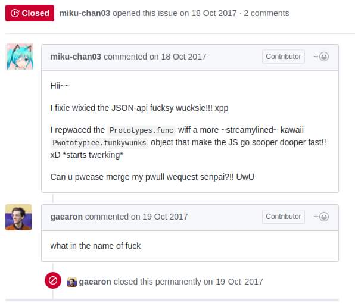

<!-- title -->

<!--lint ignore no-dead-urls-->

# Awesome UwU  

<!-- subtitle -->

Can u pwease merge my pwull wequest senpai?!! UwU

<!-- image -->

<!-- TOC -->

## Contents

- [The Font](#the-font)
- [Logos](#logos)
- [Websites](#websites)
- [Misc.](#misc)

<!-- CONTENT -->

## The Font

- [Yuruka Std by FONTWORKS](https://lets.fontworks.co.jp/fonts/218)

## Logos

- [Aikoyori/ProgrammingVTuberLogos](https://github.com/Aikoyori/ProgrammingVTuberLogos)
- [@sawaratsuki1004 on X](https://twitter.com/sawaratsuki1004)

## Websites

- [Bluesky](https://bsky.app/?kawaii=true)
- [React](https://react.dev/?uwu=true)
- [Next.js](https://nextjs.org/?uwu)
- [Hono](https://hono.dev/?kawaii=true)
- [Vue.js](https://vuejs.org/?uwu)
- [Vite](https://vitejs.dev/?uwu)
- [ElysiaJS](https://elysiajs.com/)
- [Asahi Linux](https://asahilinux.org/?kawaii=true)
- [Haskell](https://www.haskell.org/?uwu=true)
- [Qwik](https://qwik.dev/?uwu=true)

## Misc.

- [Kubernetes v1.30: Uwubernetes](https://kubernetes.io/blog/2024/04/17/kubernetes-v1-30-release/)

<!-- END CONTENT -->

## Contributing

[Contributions of any kind welcome, just follow the guidelines](contributing.md)!

### Contributors

[Thanks goes to these contributors](https://github.com/dittos/awesome-uwu/graphs/contributors)!
